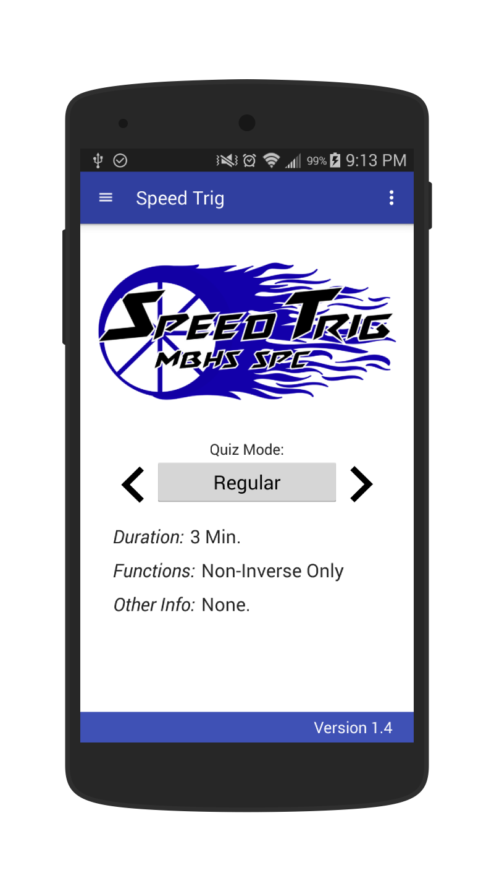

Speed Trig
==========

Speed Trig v1.0 is an application designed to help users improve their ability to compute basic 
trigonometric functions by practicing with digital quizzes on the unit circle. 

Speed Trig was designed by the Montgomery Blair High School Smartphone Programming Club of 2014-2015 
and inspired by the timed unit circle quizzes which are an integral part of the Pre-Calculus curriculum 
at MBHS. We hope to get our users up to speed on Speed Trig.

<h2>Speed Trig v1.3 and Material Design</h2>

<h2>Source</h2>

The source code in this repository reflects the app as of 2015.

<h2>Features</h2>

With the app, you can:

- Improve your ability to compute basic trigonometric functions
- Learn about the Unit Circle
-

<h2>Thanks To: </h2>

    Life, Universe, and Everything. 